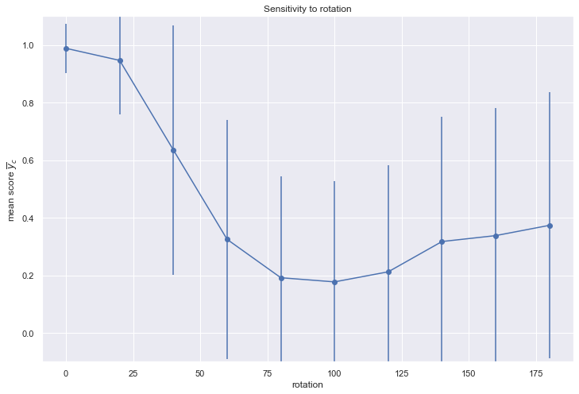

# Sensie version 0.0.1

Sensie is toolset for probing the sensitivity of a deep neural 
network model to various properties of the data. 

## Overview

An active area of research (and not a little hand-wringing) in deep learning at present is better understanding how to interpret the key features learned by DNNs, particularly in order to better understand and predict failure modes. Various algorithms and toolsets exist for interpreting DNNs; in the computer vision arena, saliency maps are an important and well-motivated technique for understanding the key features of the images used by the network in order to make its decisions. However, these maps are not equally informative in all applications, for instance in some scientific applications where inputs are not RGB images, or physical parameters are otherwise not readily discerned from a saliency map.

Sensie probes the sensitivity of a network to inputs with a particular property, . This property can be a feature of the data; an otherwise known property of a test or training set that is not provided explicitly in training; or a function that can artificially vary this property for a supplied test set. The effect of a particular property is measured according to the variance it introduces to the correct output of the network, such as the score for the correct class . Quantitatively, we seek the output  for a supplied property, .

Although the algorithm is simple, it has the potential to highlight and quantify gaps in the training set or areas of increasing unrealiability in a trained model. Sensie was written with scientific applications in mind, but can be used on any trained model.

Sensie can operate on models trained for discrete (classifier) or ~~continuous (regression) outputs~~ (coming soon).

Sensie can be adapted to works on any predictive model.

**Main outstanding issues:**
- Proper support for regression models

## Requirements

Sensie assumes a model object with a ``predict`` method (as per Keras), but with a user supplied predictor function any framework should be usable. Prequisites are listed in `requirements.txt`. The [pymc3](https://github.com/pymc-devs/pymc3) probabilistic programming framework is required for the (optional) determination of credible intervals for feature sensitivities. This can be used to assess the significance of a sensitivity analysis.

## Outline of usage

- Create a `sensie.Probe` instance to wrap a pre-trained model.
- Pass the probe a test set, ground truths, and either a vector/tensor containing the property/properties to test, or a function that mutates a training example, taking a scalar parameter indicating the size of the effect.
- Sensie will return a `sensie.SensitivityMeasure` object, a collection of the results of each test represented by `sensie.SingleTest` objects.
- Examine a plot of the outcome of each test, or print the `summary` to quantify the size of the effect.
- The sensitivity, i.e. the gradient of mean correct score with property , is determined using ordinary linear regression (`sensie.Probe.get_gradient`) or using Bayesian inference with pymc3; this in turn supplies a 50%/95% credible interval for the sensitivity.
- Where the relationship is non-linear, polynomial fits can also be visualised in order to identify regions of the parameter space where the network is most sensitive to the supplied property.

Sensie has several options for plotting the results. See the docs and examples for more information.

Sensie assumes that `model.predict` returns a tensor `t` with categorical scores, such that `t[i, j]` returns the score for class *j* for test example *i*. If this is not the case, supply a predictor function at instantiation time that does: `probe = sensie.Probe(model, predictor)` where `predictor` is a function with the signature `predictor(model, x_test)` and returns a tensor of dimensions `(N, n_classes)`.

Detailed documentation can be accessed at readthedocs.org.

## Calculation of the signficance of the effect

When Sensie reports the significance of the effect, it is reporting whether there is a detectable
linear relationship between the property measured and model's score for the correct class for
each example. In other words, it assumes that 
<p align="center"></p>

where 

<p align="center"></p> 

and uses Bayesian linear regression to determine the gradient  along with
credible intervals. If the effect of property  is small or neglible, then 
the result should be consistent with .

For properties without a natural ordering, like classes, Sensie can first 
re-order the classes/properties by the mean scores then measure the significance 
of the effect, i.e. whether there is a significant gradient under this ordering. 
Whether this is meaningful is highly context dependent! [1]

## Example

How sensitive is a model trained on MNIST digits to the orientation of the digits?
```
def rotate(x, angle):
  # code that rotates the image by angle degrees goes here, see examples/MNIST
  # x_rotated = ...
  return x_rotated

model = load_model() # a trained model

sensie_mnist = sensie.Probe(model)
sensie_mnist.predict_and_measure_perturbed(X_test, y_test, 
                                            rotate, p_min=0, p_max=180, steps=10, 
                                            label='rotation', plot=True)
```


From this we can see that the trained model is sensitive to the orientation of an input; beyond about 20 degrees, accuracy suffers significantly.

For this and some more complex examples, see the Jupyter notebooks in the `examples` directory.

## Documentation

Module docs can be found at [sensie.readthedocs.org](https://sensie.readthedocs.io/en/latest/).

### References


[1]: Consider `plt.scatter(np.arange(0, 100), np.sort(np.random.random(100)))`.
